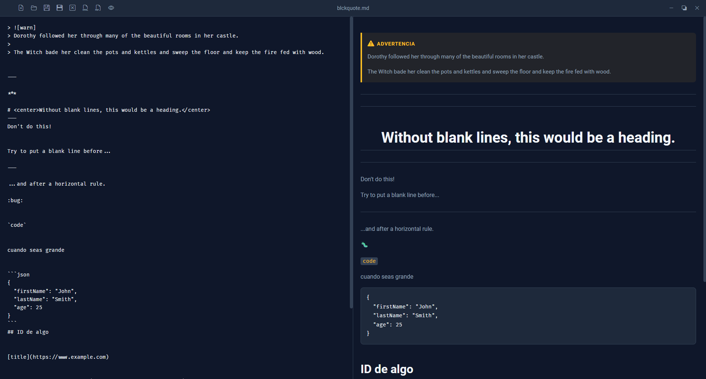

# 💎 Editor de Markdown (v2.3.0 - Edición Comercial & PRO)

<a href="ms-windows-store://pdp/?productid=9PC8MCBSJ2HJ">
  
</a>

¡Qué hacés! Te damos la bienvenida al **Editor de Markdown**, un editor e intérprete interactivo de alto rendimiento desarrollado en **Tauri V2** (Rust + HTML/CSS/JS Vanilla). 

Esta aplicación combina la ligereza y velocidad nativa de Rust con una experiencia de usuario sumamente pulida, incorporando herramientas de productividad líderes de mercado y un **modelo Freemium / PRO** para monetización directa en la Microsoft Store.



---

## 🚀 Características de la Versión 2.3.0

### 🟢 Funciones Gratuitas (Free):
*   **Barra de Formato Rápido Completa:** Negrita (`**`), Cursiva (`*`), Tachado (`~~`), Resaltado (`==`), Encabezados (H1, H2, H3), Citas, Código, Listas, Tareas interactivas y Tablas.
*   **Modo Visor Colapsable:** Ocultá el editor con una animación suave para lectura fluida.
*   **Buscador y Reemplazador Integrado:** Atajo `Ctrl + F` y `Ctrl + H` con navegación de resultados.
*   **Barra de Estado en Vivo:** Conteo de palabras, caracteres, líneas, tiempo estimado de lectura y estado del archivo.
*   **4 Temas Base:** *Slate Dark*, *Obsidian Pitch Black*, *Nordic Frost* y *Clean Paper (Modo Claro)*.
*   **Exportación:** Exportar documento a HTML y a PDF.
*   **Scroll Sincronizado Inteligente & Auto-Borrador de Respaldo.**

---

### 👑 Funciones Exclusivas PRO (Desbloqueables):
*   📽️ **Modo Presentación (Slideshow):** Transformá tu documento Markdown en una presentación interactiva a pantalla completa navegable con flechas, dividida automáticamente por `---`.
*   🧘 **Modo Enfoque Zen (Typewriter):** Interfaz limpia al 100% con la línea activa centrada para escribir sin distracciones.
*   🎨 **Pack de 4 Temas PRO:**
    *   *Cyberpunk Neon* (Fucsia neón y cian vibrante).
    *   *Dracula Vampire* (La paleta clásica para desarrolladores).
    *   *Solarized Dark* (Contraste óptico cálido).
    *   *Amber Retro CRT* (Estética de terminal monocromática ámbar).
*   💎 **Sin Interrupciones:** Desactiva todos los recordatorios periódicos y da acceso de por vida.

---

## ⌨️ Atajos de Teclado Globales

| Atajo | Acción |
| :--- | :--- |
| `Ctrl + S` | Guardar archivo actual |
| `Ctrl + Shift + S` | Guardar como... |
| `Ctrl + O` | Abrir archivo |
| `Ctrl + N` | Nuevo documento |
| `Ctrl + F` | Buscar texto |
| `Ctrl + H` | Buscar y Reemplazar |
| `Ctrl + B` / `Ctrl + I` | **Negrita** / *Cursiva* |
| `Ctrl + +` / `Ctrl + -` | Aumentar / Reducir zoom de fuente |
| `Ctrl + 0` | Restablecer tamaño de fuente (14px) |
| `Escape` | Cerrar modales, buscador, Modo Zen o Presentación |

---

## 🛠️ Instalación y Desarrollo Local

```bash
# 1. Clonar repositorio
git clone https://github.com/carlosprost/editor-markdown.git

# 2. Instalar dependencias
npm install

# 3. Iniciar entorno de desarrollo
npm run dev

# 4. Generar paquete para Microsoft Store (.exe / MSIX)
npm run build
```

---

## 🔒 Reporte de Seguridad

Para un desglose técnico de la mitigación de OWASP Top 10 y cumplimiento ISO 27001 / 27002, revisá el archivo **[SECURITY_REPORT.md](SECURITY_REPORT.md)**.

---

## 📄 Licencia

Este proyecto está bajo la Licencia MIT. Consultá el archivo `LICENSE` para más detalles.
